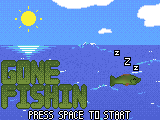

# gone-fishin

</img>

Gone Fishin is my Ludum Dare 41 entry - and my first Compo entry.

If you're reading this, I'm sorry.  Almost everything is in one directory, and I checked in builds along with the source.

This was my first Godot game and I made a few bad decisions about how to structure everything too.  

Overall it's probably not a great example of how a Godot game should be structured, in terms of file structure, classes, and scenes.  But hey, it runs!
